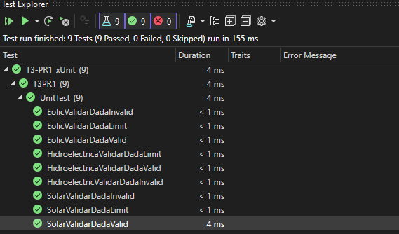

# Classes d'equivalència

## Sistema Eòlic
### Valors límit
- Mínim 5m/S, inclós

### Casos de prova
- 1 (invàlid)
- 15 (vàlid)
- 5 (en el límit)

## Sistema Solar
### Valors límit
- Mínim 1h, inclós

### Casos de prova
- 0 (invàlid)
- 12 (vàlid)
- 1 (en el límit)

## Sistema Hidroelèctric
### Valors límit
- Mínim 20m^3, inclós

### Casos de prova
- 10 (invàlid)
- 35 (vàlid)
- 20 (en el límit)

## Resultats
